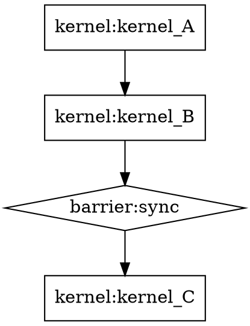

# Phase 15: Compute Graph IR — Design Document / 设计文档

> **对应 GPGPU-Sim**: CUDA Graphs API (cudaGraph)
> **参考**: NVIDIA CUDA Graphs (docs.nvidia.com/cuda/cuda-c-programming-guide),
> XLA HLO (tensorflow.org/xla), MLIR Graph Dialect

## 1. Introduction / 架构概览

```
                        ┌──────────────────────────────────────────────────┐
                        │          Compute Graph IR (Phase 15)           │
                        │                                                  │
                        │  GraphNode (DAG Node)                           │
                        │  ┌──────────────────────────────────────┐       │
                        │  │  node_id  op_type  params  deps      │       │
                        │  │  [kernel_A] → [barrier] → [kernel_B] │       │
                        │  │  [input]    → [kernel_C] → [output]  │       │
                        │  └──────────────┬───────────────────────┘       │
                        │                 │ graph_ir.py                   │
                        │                 ▼                               │
                        │  ComputeGraph (DAG Manager)                     │
                        │  ┌──────────────────────────────────────┐       │
                        │  │  add_node / add_kernel / add_memcpy  │       │
                        │  │  add_barrier / add_input / add_output│       │
                        │  │  validate() → DAG cycle detection    │       │
                        │  │  topological_order() → Kahn's algo   │       │
                        │  │  to_json() / to_dot() → serialization│       │
                        │  └──────────────┬───────────────────────┘       │
                        │                 │                               │
                        │                 ▼                               │
                        │  Underlying ISA Execution Engine               │
                        │  ┌──────────────────────────────────────┐       │
                        │  │  SIMTCore → 5-stage pipeline        │       │
                        │  │  Kernel launches → ISA instructions  │       │
                        │  └──────────────────────────────────────┘       │
                        └──────────────────────────────────────────────────┘
```

Phase 15 向 toygpgpu 添加了 **Compute Graph IR**，一种基于有向无环图 (DAG) 的计算图中间表示。Graph IR 提供：

1. **GraphNode**: 表示计算操作 (kernel, memcpy, barrier, input, output) 的节点数据结构
2. **ComputeGraph**: DAG 管理器，支持节点添加、依赖管理、环检测、拓扑排序、序列化
3. **验证与序列化**: validate() 通过 DFS 进行环检测，topological_order() 使用 Kahn 算法生成调度顺序，to_json()/to_dot() 导出为 JSON 或 Graphviz DOT 格式

Phase 15 adds the **Compute Graph IR**, a DAG-based intermediate representation for computation graphs to toygpgpu. The Graph IR provides:

1. **GraphNode**: A node data structure representing compute operations (kernel, memcpy, barrier, input, output)
2. **ComputeGraph**: A DAG manager supporting node addition, dependency management, cycle detection, topological sorting, and serialization
3. **Validation and Serialization**: validate() performs cycle detection via DFS, topological_order() uses Kahn's algorithm for scheduling order, to_json()/to_dot() export to JSON or Graphviz DOT format

### 新增指令 / New Instructions

无新增指令。Phase 15 是纯软件 IR 层，不修改 ISA。

No new opcodes. Phase 15 is a pure software IR layer with no ISA changes.

### 新增文件 / New File

| 文件 | 说明 |
|------|------|
| `src/graph_ir.py` | Compute Graph IR 模块 (~213 行)，包含 GraphNode、ComputeGraph 及完整的 DAG 操作 API |

## 2. Motivation / 设计动机

### 2.1 为什么需要 Compute Graph IR？/ Why Compute Graph IR?

Phase 14 引入了 CuTile 编程模型和 WGMMA 指令，使程序员能够在高级 DSL 层面描述 tile 计算。然而，整个执行模型仍然是单 kernel 的——一次加载一个程序，运行一个 kernel，然后结束。实际 GPU 应用中：

- 多个 kernel 之间存在数据依赖关系
- kernel 之间需要同步 (barrier)
- 需要将数据在不同内存区域间传输 (memcpy)
- CUDA Graphs 可以将多个 kernel 及其依赖关系捕获为一个图，一次性提交并重复执行

While Phase 14 introduced the CuTile programming model and WGMMA instruction for high-level tile descriptions, the execution model remains single-kernel — load one program, run one kernel, finish. Real GPU applications require:

- Data dependencies between multiple kernels
- Synchronization between kernels (barriers)
- Data transfers between memory regions (memcpy)
- CUDA Graphs capture multiple kernels and their dependencies as a single graph for one-shot submission and replay

Compute Graph IR 的设计动机 / Compute Graph IR is motivated by:

1. **多 kernel 调度 / Multi-Kernel Scheduling**: DAG 可以表示多个 kernel 之间的执行顺序和依赖关系，使调度器能够自动确定合法的执行序列。
2. **图优化 / Graph Optimization**: DAG 表示使编译器能够执行 kernel 融合、死 kernel 消除、通信优化等图级优化。
3. **可重放性 / Replayability**: 与 CUDA Graphs 类似，一次构建的图可以被反复执行，避免了重复的 kernel 启动开销。
4. **可视化 / Visualization**: DOT 格式导出使计算图可以直观地在前端中展示，有助于教学和调试。
5. **IR 标准接口 / Standard IR Interface**: JSON 序列化使计算图可以被前端 (Python DSL) 和后端 (执行引擎) 共享。

### 2.2 与真实 GPU 图执行模型的对应 / Correspondence to Real GPU Graph Models

```
真实 GPU 图模型           │ toygpgpu              │ 说明
──────────────────────────┼───────────────────────┼────────────────────
CUDA Graphs (cudaGraph)  │ ComputeGraph           │ DAG 可重放图
cudaGraphAddKernelNode   │ add_kernel()           │ 添加 kernel 节点
cudaGraphAddMemcpyNode   │ add_memcpy()           │ 添加数据传输节点
cudaGraphAddEmptyNode    │ add_barrier()          │ 添加 barrier 同步节点
cudaGraphInstantiate     │ validate()             │ 图验证 + 环检测
cudaGraphLaunch          │ (手动遍历 topo 顺序)   │ 图执行启动
XLA HLO Module           │ ComputeGraph           │ 计算图 IR
MLIR Graph Dialect       │ GraphNode + DAG        │ 基于 DAG 的 IR
TensorFlow GraphDef      │ to_json() / from_json()│ 序列化格式
```

### 2.3 与 CUDA Graphs 的对应关系 / CUDA Graphs Correspondence

NVIDIA CUDA Graphs 允许将一系列 GPU 操作捕获为图，然后一次性提交执行：

```
CUDA Graphs 概念               │ toygpgpu                    │ 说明
───────────────────────────────┼─────────────────────────────┼────────────────────
cudaGraphCreate                │ ComputeGraph(name)          │ 图创建
cudaGraphAddKernelNode         │ add_kernel(name, program)   │ kernel 节点
cudaGraphAddMemcpyNode         │ add_memcpy(name, src,dst)   │ memcpy 节点
cudaGraphAddEmptyNode          │ add_barrier(name)           │ 空/同步节点
cudaGraphInstantiate           │ validate()                  │ 图验证 (含环检测)
cudaGraphLaunch                │ topological_order() → exec  │ 拓扑排序后执行
cudaGraphDestroy               │ (GC 自动回收)               │ 图销毁
cudaGraphGetNodes              │ nodes dict                  │ 节点查询
cudaGraphExportToJSON / Import │ to_json() / from_json()     │ JSON 序列化
```

### 2.4 与 GPGPU-Sim / XLA 的对应 / GPGPU-Sim / XLA Correspondence

```
概念                         │ toygpgpu                     │ 说明
────────────────────────────┼──────────────────────────────┼──────────────────
GPGPU-Sim kernel launch     │ add_kernel()                   │ 多 kernel 调度
GPGPU-Sim barrier sync      │ add_barrier()                  │ 同步节点
XLA HLO computation         │ ComputeGraph                   │ 计算图 IR
XLA HLO instruction         │ GraphNode                      │ IR 节点
MLIR graph region           │ ComputeGraph                   │ region = DAG
TensorFlow GraphDef node    │ GraphNode                      │ protobuf 节点
```

## 3. Algorithm and Theory / 核心算法与理论

### 3.1 GraphNode / 图节点

GraphNode 是计算图的基本单元，使用 Python `@dataclass` 实现。

GraphNode is the fundamental unit of the computation graph, implemented using Python `@dataclass`.

```python
@dataclass
class GraphNode:
    node_id: int           # 唯一节点 ID (自增)
    op_type: str           # 节点类型: "kernel" | "memcpy" | "barrier" | "input" | "output"
    name: str              # 节点名称 (可读标识)
    params: Dict           # 节点参数 (与 op_type 关联)
    dependencies: List[int] # 前置依赖节点 ID 列表 (DAG 边)
```

五种节点类型 / Five Node Types:

| op_type | 语义 | params 内容 |
|---------|------|-------------|
| `kernel` | GPU kernel 执行 | program, grid_dim, block_dim |
| `memcpy` | 设备间内存拷贝 | src_addr, dst_addr, size |
| `barrier` | 同步点 | (空) |
| `input` | 图入口数据 | addr, size |
| `output` | 图出口数据 | addr, size |

### 3.2 ComputeGraph API / 计算图 API

ComputeGraph 提供完整的 DAG 操作接口。

ComputeGraph provides a complete DAG operation interface.

```python
class ComputeGraph:
    def __init__(self, name: str = "unnamed"):
        self.nodes: Dict[int, GraphNode] = {}
        self._next_id = 0

    def add_node(self, op_type, name, params, dependencies) -> int
    def add_kernel(self, name, program, grid_dim, block_dim, dependencies) -> int
    def add_memcpy(self, name, src_addr, dst_addr, size, dependencies) -> int
    def add_barrier(self, name, dependencies) -> int
    def add_input(self, name, addr, size) -> int
    def add_output(self, name, addr, size, dependencies) -> int
    def validate(self) -> Tuple[bool, str]
    def topological_order(self) -> List[int]
    def to_dict(self) -> Dict
    def to_json(self) -> str
    def to_dot(self) -> str
```

便捷方法 (add_kernel, add_memcpy, add_barrier, add_input, add_output) 封装了 add_node，提供类型安全的参数接口。

Convenience methods (add_kernel, add_memcpy, add_barrier, add_input, add_output) wrap `add_node` to provide type-safe parameter interfaces.

### 3.3 DAG 验证 — DFS 环检测 / DAG Validation — DFS Cycle Detection

`validate()` 使用三色标记 DFS (White-Gray-Black) 检测环路。

`validate()` uses three-color DFS (White-Gray-Black) for cycle detection.

```python
WHITE, GRAY, BLACK = 0, 1, 2
color = {nid: WHITE for nid in self.nodes}

def dfs(nid):
    color[nid] = GRAY                    # 正在访问 / Visiting
    for dep in self.nodes[nid].dependencies:
        if color[dep] == GRAY:           # 发现回边 → 环 / Back edge → cycle!
            return False
        if color[dep] == WHITE:
            if not dfs(dep):
                return False
    color[nid] = BLACK                    # 访问完毕 / Done
    return True

# 验证 1: 图非空
# 验证 2: 所有依赖节点存在
# 验证 3: DFS 无环
```

算法的直观理解 / Intuition:
- **白色** (WHITE): 节点未被访问，相当于"未探索区域"
- **灰色** (GRAY): 节点正在 DFS 递归栈中，相当于"正在探索"
- **黑色** (BLACK): 节点及其所有子孙都已访问完毕

如果在 DFS 过程中遇到灰色节点，说明存在一条从当前节点回到祖先节点的路径——这就是环。

### 3.4 拓扑排序 — Kahn 算法 / Topological Sort — Kahn's Algorithm

`topological_order()` 使用 Kahn 算法 (基于入度的 BFS) 生成合法的节点执行顺序。

`topological_order()` uses Kahn's algorithm (in-degree based BFS) to produce a valid execution order.

```python
def topological_order(self) -> List[int]:
    in_degree = {nid: len(n.dependencies) for nid, n in self.nodes.items()}
    queue = [nid for nid, d in in_degree.items() if d == 0]  # 零入度节点入队
    order = []

    while queue:
        nid = queue.pop(0)
        order.append(nid)
        # 减少所有依赖该节点的入度
        for other in self.nodes.values():
            if nid in other.dependencies:
                in_degree[other.node_id] -= 1
                if in_degree[other.node_id] == 0:
                    queue.append(other.node_id)

    return order
```

算法保证 / Algorithmic Guarantees:
- 如果图有环，返回的列表长度将小于节点总数（部分节点入度永远不为零）
- 如果图无环，返回的拓扑序保证：对任意边 u→v，u 在 order 中出现在 v 之前

### 3.5 序列化 / Serialization

#### JSON 格式 / JSON Format

```json
{
  "name": "example_pipeline",
  "nodes": [
    {
      "id": 0,
      "type": "kernel",
      "name": "kernel_A",
      "params": {
        "grid_dim": [1],
        "block_dim": [4]
      },
      "deps": []
    },
    {
      "id": 1,
      "type": "kernel",
      "name": "kernel_B",
      "params": {},
      "deps": [0]
    }
  ]
}
```

#### DOT 格式 / DOT Format (Graphviz)



节点形状 / Node Shapes:
| op_type | DOT Shape | 含义 |
|---------|-----------|------|
| kernel | box | 方块 — 计算操作 |
| memcpy | ellipse | 椭圆 — 数据传输 |
| barrier | diamond | 菱形 — 同步点 |
| input | invhouse | 倒梯形 — 数据入口 |
| output | house | 正梯形 — 数据出口 |

## 4. Architecture / 架构设计

### 4.1 Module Breakdown / 模块分解

| File / 文件 | Purpose / 用途 | Change from Phase 14 / 相对 Phase 14 的变化 |
|-------------|---------------|------------------------------------------|
| `graph_ir.py` | Compute Graph IR: GraphNode + ComputeGraph + validate/serialize | **NEW** (~213 lines) |
| `isa.py` | Opcode definitions (unchanged) | Same |
| `assembler.py` | Two-pass assembler (unchanged) | Same |
| `simt_core.py` | SIMT pipeline (unchanged) | Same |
| `cutile_parser.py` | CuTile DSL parser (unchanged, backward compatible) | Same |
| `learning_console.py` | Interactive console — new `graph` command (Phase 15) | ADDED: `graph` command + `print_graph_info()` |
| All other modules | Unchanged | Same |

### 4.2 核心数据结构 / Core Data Structures

#### GraphNode

```python
@dataclass
class GraphNode:
    node_id: int                    # 全局唯一 ID (自增)
    op_type: str                    # "kernel" | "memcpy" | "barrier" | "input" | "output"
    name: str                       # 人类可读名称
    params: Dict                    # 操作参数
    dependencies: List[int]         # 依赖的前置节点 ID 列表
```

#### ComputeGraph

```python
class ComputeGraph:
    nodes: Dict[int, GraphNode]     # node_id → GraphNode 映射
    _next_id: int                   # 下一个可用节点 ID (自增)
    name: str                       # 图名称

    # 构建 API
    add_node(op_type, name, params, dependencies) -> int
    add_kernel(name, program, grid_dim, block_dim, dependencies) -> int
    add_memcpy(name, src_addr, dst_addr, size, dependencies) -> int
    add_barrier(name, dependencies) -> int
    add_input(name, addr, size) -> int
    add_output(name, addr, size, dependencies) -> int

    # 验证 API
    validate() -> Tuple[bool, str]

    # 调度 API
    topological_order() -> List[int]

    # 序列化 API
    to_dict() -> Dict
    to_json() -> str
    to_dot() -> str

    # 反序列化 API (static)
    from_dict(data) -> ComputeGraph
    from_json(json_str) -> ComputeGraph
```

### 4.3 Module Interfaces / 模块接口

```python
# graph_ir.py — Public API:
#   GraphNode(node_id, op_type, name, params, dependencies)
#   ComputeGraph(name)
#     .add_node(op_type, name, params, dependencies) -> int
#     .add_kernel(name, program, grid_dim, block_dim, dependencies) -> int
#     .add_memcpy(name, src_addr, dst_addr, size, dependencies) -> int
#     .add_barrier(name, dependencies) -> int
#     .add_input(name, addr, size) -> int
#     .add_output(name, addr, size, dependencies) -> int
#     .validate() -> (bool, str)
#     .topological_order() -> List[int]
#     .to_json() -> str
#     .to_dot() -> str
#     .from_json(s) -> ComputeGraph
#     .from_dict(d) -> ComputeGraph

# Module dependencies:
#   graph_ir.py: 仅依赖 Python 标准库 (dataclasses, typing, json)
#   No dependencies on other toygpgpu modules
#   All existing modules unchanged (backward compatible)
```

### 4.4 Graph IR 完整管线 / Full Graph IR Pipeline

```
Python API 调用
    │
    ▼
ComputeGraph 构建 (add_kernel / add_barrier / ...)
    │
    ▼
validate() ──→ DAG 环检测 (DFS White-Gray-Black)
    │               │
    │               ├── 无环 → (True, "Valid DAG")
    │               └── 有环 → (False, "Cycle detected at node X")
    │
    ▼
topological_order() ──→ 拓扑排序节点列表 (Kahn BFS)
    │
    ▼
to_json() ──────→ JSON 字符串 (跨语言/跨工具共享)
to_dot() ────────→ DOT 字符串 (Graphviz 可视化)
    │
    ▼
(可选) from_json() ──→ 反序列化重建 ComputeGraph
```

#### build_example_graph() 示例 / Example

```python
from graph_ir import *

g = ComputeGraph("example_pipeline")

# kernel_A (无依赖)
n_a = g.add_kernel("kernel_A", grid_dim=(1,), block_dim=(4,))

# kernel_B 依赖 kernel_A
n_b = g.add_kernel("kernel_B", grid_dim=(1,), block_dim=(4,), dependencies=[n_a])

# barrier 同步点
n_barrier = g.add_barrier("sync", dependencies=[n_b])

# kernel_C 依赖 barrier
g.add_kernel("kernel_C", grid_dim=(1,), block_dim=(4,), dependencies=[n_barrier])

print(g.validate())        # (True, "Valid DAG")
print(g.topological_order())  # [0, 1, 2, 3]  (Kahn 序)
print(g.to_dot())          # Graphviz DOT 格式
```

## 5. Functional Processing Flow / 功能处理流程

### 5.1 基本图构建与验证 / Basic Graph Construction and Validation

场景: 构建三个 kernel 的流水线图 (A → B → C)，验证其合法性并导出 DOT。

Scenario: Build a three-kernel pipeline graph (A → B → C), validate its legality, and export DOT.

```python
from graph_ir import ComputeGraph

g = ComputeGraph("pipeline")
a = g.add_kernel("kernel_A", program=[0x01, 0x02], grid_dim=(1,), block_dim=(4,))
b = g.add_kernel("kernel_B", program=[0x03, 0x04], grid_dim=(1,), block_dim=(4,), dependencies=[a])
c = g.add_kernel("kernel_C", program=[0x05, 0x06], grid_dim=(1,), block_dim=(4,), dependencies=[b])

valid, msg = g.validate()
print(valid, msg)           # True "Valid DAG"

order = g.topological_order()
print(order)                # [0, 1, 2] (Kahn 序)

print(g.to_dot())
# digraph "pipeline" {
#   rankdir=TB;
#   n0 [label="kernel:kernel_A" shape=box];
#   n1 [label="kernel:kernel_B" shape=box];
#   n2 [label="kernel:kernel_C" shape=box];
#   n0 -> n1;
#   n1 -> n2;
# }
```

### 5.2 环检测 / Cycle Detection

当用户错误地构建了包含环的图时，validate() 会检测到并返回错误信息。

When a user incorrectly builds a graph containing a cycle, validate() detects it and returns an error.

```python
g = ComputeGraph("bad_graph")
a = g.add_kernel("A", block_dim=(4,))
b = g.add_kernel("B", block_dim=(4,), dependencies=[a])
c = g.add_kernel("C", block_dim=(4,), dependencies=[b])

# 人为引入环: A 依赖 C
g.nodes[a].dependencies.append(c)

valid, msg = g.validate()
print(valid, msg)           # False "Cycle detected at node 0"
```

算法追踪 / Algorithm Trace:
```
DFS 从 node 0 (A) 开始:
  0: WHITE → GRAY
    依赖 [2] → 访问 node 2 (C)
  2: WHITE → GRAY
    依赖 [1] → 访问 node 1 (B)
  1: WHITE → GRAY
    依赖 [0] → node 0 是 GRAY! → 环! ⛔
```

### 5.3 完整的数据流图 / Complete Data Flow Graph

一个包含输入、memcpy、kernel、barrier、输出的完整数据流图：

A complete data flow graph with input, memcpy, kernel, barrier, and output:

```python
g = ComputeGraph("data_flow")

# 图入口: 数据输入
in1 = g.add_input("input_data_A", addr=0x00, size=64)
in2 = g.add_input("input_data_B", addr=0x40, size=64)

# 数据传输到设备
cpy1 = g.add_memcpy("H2D_A", src_addr=0x00, dst_addr=0x100, size=64, dependencies=[in1])
cpy2 = g.add_memcpy("H2D_B", src_addr=0x40, dst_addr=0x200, size=64, dependencies=[in2])

# 计算 kernel (依赖两个 memcpy)
k1 = g.add_kernel("compute", grid_dim=(1,), block_dim=(4,), dependencies=[cpy1, cpy2])

# barrier 同步
bar = g.add_barrier("post_compute", dependencies=[k1])

# 结果写回
cpy3 = g.add_memcpy("D2H", src_addr=0x300, dst_addr=0x80, size=64, dependencies=[bar])

# 图出口
g.add_output("output_result", addr=0x80, size=64, dependencies=[cpy3])

valid, msg = g.validate()
print(valid, msg)           # True "Valid DAG"
print(f"Topo order: {g.topological_order()}")
# 可能输出: [0, 1, 2, 3, 4, 5, 6, 7] (Kahn BFS 序)
```

### 5.4 JSON 导入导出 / JSON Import/Export

```python
# 构建 → 导出 → 导入 → 重新验证
g = build_example_graph()
json_str = g.to_json()
print(json_str)
# {
#   "name": "example_pipeline",
#   "nodes": [ ... ]
# }

# 从 JSON 重建
g2 = ComputeGraph.from_json(json_str)
print(g2.validate())        # (True, "Valid DAG")
print(g2.topological_order())  # 与原始图一致
```

### 5.5 关键设计决策 / Key Design Decisions

1. **纯 Python 实现，零外部依赖**: graph_ir.py 只使用 Python 标准库 (dataclasses, typing, json)，不需要安装任何第三方库。这保证了最小依赖和最大可移植性。

2. **DAG 边方向为依赖方向**: 边 n0 → n1 表示 "n0 必须在 n1 之前执行"。这与 CUDA Graphs 的依赖语义一致，也与 Kahn 算法的概念相匹配。

3. **节点 ID 自增，不重复使用**: `_next_id` 始终递增，即使节点被删除也不会复用 ID。这简化了 ID 管理并保证了唯一性。

4. **序列化使用 JSON 而非 protobuf**: 相比 TensorFlow 的 protobuf 序列化，JSON 是人类可读的，在 Python 中无需额外代码生成步骤。适合教学和小型 IR 交换场景。

5. **DOT 格式支持多形状**: 不同节点类型使用不同形状 (box/ellipse/diamond/invhouse/house)，使可视化输出更直观。

6. **与所有已有功能完全向后兼容**: Phase 0-14 的所有功能和测试保持不变。graph_ir.py 不修改任何现有模块。

7. **无 ISA 修改**: Phase 15 是纯软件抽象层，不引入新 opcode、新指令、新流水线阶段。类似于 CUDA Graphs 在 CUDA API 层面的图抽象，不修改 PTX ISA。

## 6. Comparison with Phase 14 / 与 Phase 14 的对比

| Aspect / 方面 | Phase 14 | Phase 15 | Change / 变化 |
|---------------|----------|----------|---------------|
| **Focus** | CuTile programming model / tile DSL | Compute Graph IR / DAG abstraction | NEW direction |
| **New Opcodes** | OP_WGMMA(0x38) | None | No ISA changes |
| **New Assembly Mnemonics** | WGMMA | None | No ISA changes |
| **New Files** | `cutile_parser.py` (~237 lines) | `graph_ir.py` (~213 lines) | ADDED: 1 new module |
| **ISA File** | 112 lines | 112 lines (unchanged) | Same |
| **Assembler File** | ~247 lines | ~247 lines (unchanged) | Same |
| **simt_core.py** | ~505 lines | ~505 lines (unchanged) | Same |
| **Abstraction Level** | Kernel-level DSL + ISA | Multi-kernel graph IR | Elevated to DAG level |
| **Serialization** | None (CuTile DSL text only) | JSON / DOT (graph_ir.py) | NEW: structured serialization |
| **Dependencies** | Python stdlib + toygpgpu modules (assembler) | Python stdlib only (zero dep on other modules) | Lighter dependencies |
| **Graph Validation** | None | DFS cycle detection + dependency check | NEW: DAG validation |
| **Topological Sort** | None | Kahn's algorithm | NEW: scheduling order |
| **Visualization** | None (text output only) | DOT format (Graphviz compatible) | NEW: graph visualization |
| **Programming Model** | Single kernel + tile DSL | Multi-kernel DAG with dependencies | Multi-kernel coordination |
| **Demo Programs** | 13_cutile_matmul.cutile (CuTile DSL) | build_example_graph() (Python API) | NEW: programmatic graph construction |
| **Test Suite** | test_phase14.py (6 tests) | test_phase15.py (pending) | NEW: graph IR focused |
| **New Module Dependencies** | cutile_parser depends on assembler | graph_ir has zero dependencies | Independent module |
| **Backward Compatibility** | All Phase 0-13 unchanged | All Phase 0-14 unchanged | Maintained |
| **Reference Design** | CUTLASS WarpLevelMma, Triton DSL, Tensor Cores | CUDA Graphs, XLA HLO, MLIR Graph | Multi-kernel graph abstraction |

## 7. Known Issues and Future Work / 遗留问题与后续工作

1. **无图执行引擎**: 当前 ComputeGraph 只构建和验证 DAG，不实际执行图。需要实现一个图执行引擎，按拓扑顺序依次 launch kernel / 执行 memcpy。

2. **无条件/循环节点**: 实际计算图需要支持条件分支 (if/else) 和循环 (while/for) 节点。当前只支持线性依赖的 DAG。

3. **无子图支持**: CUDA Graphs 支持嵌套子图 (child graphs)。当前 ComputeGraph 不支持在节点中包含子图。

4. **无节点删除/修改**: 添加节点后无法删除或修改已有节点。这限制了图的增量构建和优化能力。

5. **无图优化**: 没有实现 kernel 融合、死节点消除、通信优化等图级优化 pass。这些是高阶编译器 IR 的核心功能。

6. **无内存规划**: 图节点之间的内存分配和生命周期管理未实现。实际执行需要为每个 kernel 的输出分配临时缓冲区。

7. **无跨图依赖**: 不支持跨图的数据依赖或执行顺序约束。每个 ComputeGraph 是独立隔离的。

8. **拓扑排序不处理并行性**: Kahn 算法返回一个顺序列表，不指示哪些节点可以并行执行。需要扩展以支持并行调度。

9. **DOT 输出限于基础格式**: 当前 DOT 输出没有颜色编码、子图集群、或自定义样式。Graphviz 的高级可视化功能未利用。

10. **无 CUDA Graphs 的 update 语义**: CUDA Graphs 支持 "更新" 图中的节点参数而不重建图。当前 graph_ir 不支持此功能。

11. **序列化未版本化**: JSON/DOT 格式没有版本号，格式变更时无法向前兼容。

12. **from_json() 不验证输入**: 反序列化时假设 JSON 格式合法，不进行模式验证。损坏的 JSON 可能导致异常。
